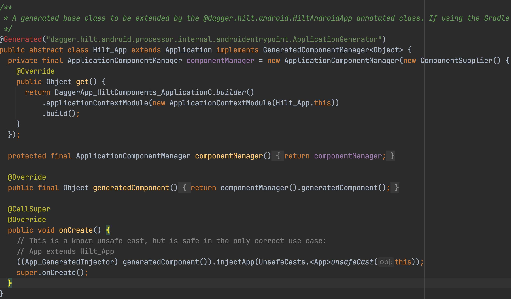

# Hilt Dependency Injection: Getting Started
###### Manage your dependencies with ease by utilising Hilt library  

Hilt is a dependency injection library built on top of the Dagger library. Dagger is arguably the most popular tool for dependency injection on Android. But, it has its drawbacks, like setup complexity and a lot of boilerplate code for bigger projects. Hilt has been created to mitigate some of those drawbacks. Hilt brings us major improvements in terms of overal usage complexity and less boilerplate code. This makes it an appealing tool to use in modern Android development.  Let's see how. :)


## Gradle dependencies

To start, you need to set up your gradle files. Add `hilt-android-gradle-plugin` to the project-level **build.gradle** file.  

~~~kotlin
buildscript {
    ...
    dependencies {
        ...
        classpath 'com.google.dagger:hilt-android-gradle-plugin:2.38.1'
    }
}
~~~

Next, apply the plugin and add the dependencies to the module-level **build.gradle** file.

~~~kotlin
plugins {
  id 'kotlin-kapt'
  id 'dagger.hilt.android.plugin'
}

android {
    ...
}

dependencies {
    implementation "com.google.dagger:hilt-android:2.38.1"
    kapt "com.google.dagger:hilt-compiler:2.38.1"
}
~~~

Final step in the gradle setup is to enable Java 8 support.  

~~~kotlin
android {
    ...
    compileOptions {
        sourceCompatibility JavaVersion.VERSION_1_8
        targetCompatibility JavaVersion.VERSION_1_8
    }
}
~~~

With the gradle ceremonies out of the way, you can start using Hilt in your app.


## Creating Hilt Application

First thing you need to do when integrating Hilt is to create a custom class which extends `Application`. Annotate the class with `@HiltAndroidApp` annotation. 

~~~kotlin
@HiltAndroidApp
class App : Application()
~~~

This enables Hilt code generation and creates a dependency container at the application level. 
Build your app and search for **Hilt_App.java**. It should look something like this: 




## Binding Instances

You need to tell Hilt how to create instances of your dependencies. This process is called binding. There's a couple of ways to do this. Which option you're going to use depends on whether you have the access to the classes' constructor, or if you want to bind a concrete implementation to the more abstract type. Let's start with the simplest one.

### @Inject

In case you own the class that you want to add to the HIlt container (bind it), you can simply annotate the constructor of the class with the `@Inject`. By doing this, you tell Hilt that it should use this constructor to provide an instance of that class. Let's see an example.

```s
class GetMoviesUseCase @Inject constructor() { ... }
```

Hilt now knows how to provide an instance of `GetMoviesUseCase` and is able to inject it wherever needed. 

### Hilt Modules & @Provides

In the example above you simply used constructor to bind an instance. But, what if you don't have access to the constructor? - **Hilt modules** to the rescue. Let's check out an example by binding `Retrofit` instance.

```kotlin
@Module
@InstallIn(SingletonComponent::class)
object NetworkingModule {
  
}
```

To start, you need to create a Hilt module and annotate it with `@Module`. Ignore `@InstallIn` annotation for now, I'll explain it later. You can use multiple modules to separate bindings for different uses. For example, you can have `NetworkingModule` for network related bindings, `DatabaseModule` for database related bindings, etc. 

Now that you have the module ready, it's time to write the provider for `Retrofit`. 

```kotlin
@Module
@InstallIn(SingletonComponent::class)
object NetworkingModule {
  
  @Provides
  fun provideRetrofit(): Retrofit { //Other dependencies - left out for brevity
    Retrofit.Builder()
    .baseUrl("https://www.example.com")
    .build()
  }
}
```

Return type of the annotated method tells Hilt the **type** of instance it provides. The method body tells **how** to create an instance of the type. Hilt executes this body every time it needs to provide an instance of this type. 

### @Binds

Consider the case where you have an interface and you want to let Hilt know how to provide it. You can't constructor inject an interface, but you can use `@Binds` annotation on a method inside of a module. Similar to `@Provides`. Here's an example:

```kotlin
@Module
@InstallIn(ActivityRetainedComponent::class) 
abstract class InteractionModule {
  
  @Binds
  abstract fun bindNowPlayingUseCase(getNowPlayingMoviesUseCaseImpl: GetMoviesUseCaseImpl): GetMoviesUseCase
}
```

Notice that the module class and the binding function are `abstract`. As in the previous example, the return type tells Hilt what interface the function provides instances of. The parameter that you pass to the function tells Hilt which concrete implementation to provide. 


## Hilt Components

Hilt generates components for every Android class in which you can perform dependency injection. You can refer to these components in `@InstallIn` annotation. Every component is responsible for injecting its bindings into the corresponding Android class (Activity, Fragment, Service...). 
You can check out the full list of the generated components in the [official documentation](https://developer.android.com/training/dependency-injection/hilt-android#generated-components). 

Great thing about Hilt is that it automatically generates these components and also manages their lifecycle. It does so by following the lifecycle of the corresponding Android class.

### Injection Into Android Classes

In the examples above, you've seen `@InstallIn` annotation. This annotation simply tells Hilt which Android class the module will be used in. Let's see an example for an Activity. 

```kotlin
@AndroidEntryPoint
class HomeActivity: AppCompatActivity() {
  
	@Inject lateinit var retrofit: Retrofit
}
```

To enable Hilt injection into Android classes, you need to annotate each class with `@AndroidEntryPoint`. This generates a corresponding component for the Android class. If you want to inject dependencies into a `Fragment`, make sure that the fragment's parent `Activity` also has this annotation. 


## Scoping in Hilt


